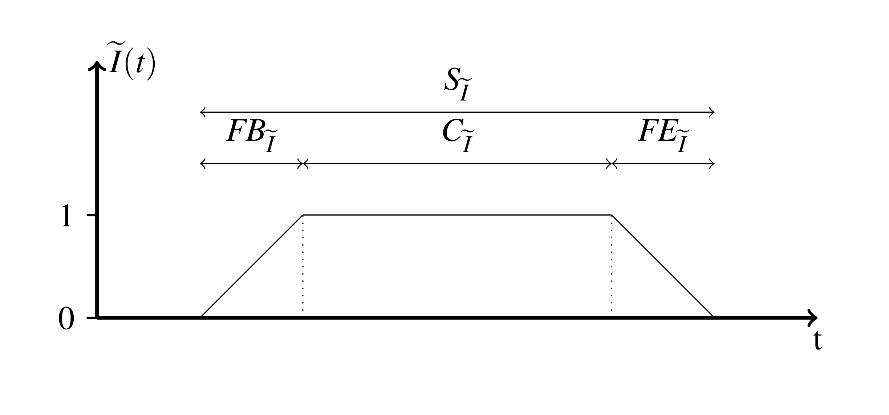

.. _intro:

============
Introduction
============

This PostgreSQL extension adds a new datatype `sfti` to the database. This type
allows you to represent certain types of fuzzy time intervals in the database. 
These can then be queried using the `Allen relations`, a common set of relations
defined by `Allen` for two sharp time intervals, but equally valid for two fuzzy
time intervals. We have developed this way of handling temporal information
because as an agency dealing with heritage, we are often confronted with temporal
information that is only partially known. This can be because
the information is unknow to everybody, or just isn't present in the sources
we're dealing with. The information can be of subjective nature as well, eg.
it's very hard to say when exactly the `industrial revolution` started and ended.

Representing a fuzzy time interval
----------------------------------

A fuzzy time interval is a fuzzy set of time points. Every time point can be
considered a point on the timeline. Because it's a fuzzy set, there are some 
differences with a regular (sharp) time interval. A shap time interval is a 
sharp set of time points. This means that any point in time is either in or out
of the set. With a fuzzy set, we can state to what degree a time point is a part
of the set. This is generally expressed as a number between 0 and 1. Whereby 0 
means that the time point is definately not a part of the set and 1 means that
it definately is. Any numer in between expresses the degree to which we're 
certain the time point is a part of the set.

If we visualise this, we generally get a trapezoidal shape that represents our
fuzzy time interval.

For every point on our timeline `t`, there's a corresponding value of the 
membership function. Our fuzzy time interval has a fuzzy beginning (`FB`) and a
fuzzy ending (`FE`). These are the periods of time where our interval is starting
to happen or ending. Or they can be the periods of time we are uncertain about.
The part of the interval that we are certain about is called the core (`C`). 
Finally, the whole of the core and the fuzzy beginning and end form the support
(`S`). So, while the core contains all the time points that are certainly a part
of the `fti`, the support contain all the time points that might be part of the
time interval.

As we pointed out, a fuzzy time interval is generally trapezoïdal in shape, but
does not necessarily have to be so. It could for eg. be possibe for an event
to decrease in intensity at some point in time during it's lifespan. But,
these simple trapezoïdal fuzzy time intervals are much easier to work with than
more complex versions and they are by far the most common type for most types
of operations. Therefore, our `simple Fuzzy Time Interval` extension only 
supports this type of `fti`.

Our `sfti` datatype can be serialised using 5 different values. We tend to 
referer to these as `sa`, `ca`, `cb`, `sb` and `l`. The first four of these
refer to the beginning and end of the `Support` (`sa` and `sb`) and the 
`Core` (`ca` and `cb`). The final value represents the highest deegree of 
certainty we have about any one point in this `sfti`. This will generally be
`1.0`, which would mean that the timepoints that make up the `Core` are 
definately a part of this interval. If this values is less than `1.0`, it would
mean that there is no single timepoint of which we are certain that it belongs
to the interval.

In our `sfti` datatype, every time point is a floating point number, not an
actual date object. To make it easier to construct new `sfti`'s, we've created
a couple of utility functions. These functions generally take sharp temporal
objects and turn them into numbers using a certain algoritm. Eg. the 15th of 
november 1972 wil be turned into `1972.87158469945`. This keeps the intrinsic
order of the timepoints alive without have to keep on doing costly calculations
on dates. Please keep in mind there is no year 0, but there is a time point `0`.
So, the year 50 BC is actually timepoint `-49`.

Examples
--------

Generate a time point for a certain date.

.. code-block:: sql

    pgsfti=> SELECT sfti_makex('1972-11-15'::date);
        sfti_makex    
    ------------------
     1972.87158469945
    (1 row)

Turn a single date into a `sfti` representing a single date. In effect, this
is an `fti` where `sa` = `ca` = `cb` = `sb`.

.. code-block:: sql

    pgsfti=> SELECT sfti_makesfti('1972-11-15');
                sfti_makesfti            
    -------------------------------------
     (1972.87,1972.87,1972.87,1972.87,1)
    (1 row)

Create a `sfti` that represents a sharply delimited time interval. In effect,
this is a sharp time interval represented as a `sfti`. In this case, `sa` = `ca`
and `cb` = `sb` and `ca` < `cb`.

.. code-block:: sql

    pgsfti=> SELECT sfti_makesfti('1972-11-15'::date, '1978-09-14'::date);
                sfti_makesfti           
    -----------------------------------
     (1972.87,1972.87,1978.7,1978.7,1)
    (1 row)

Create a `sfti` that reprensent a fully fuzzy time interval.

.. code-block:: sql

    pgsfti=> SELECT sfti_makesfti('1972-01-01'::date, '1972-12-31'::date, '1978-01-01'::date, '1978-12-31'::date);
          sfti_makesfti      
    -------------------------
     (1972,1973,1978,1979,1)
    (1 row)

Create a `sfti` that reprensent a fully fuzzy time interval that contains no
time points we are absolutely sure about.

.. code-block:: sql

    pgsfti=> SELECT sfti_makesfti('1972-01-01'::date, '1972-12-31'::date, '1978-01-01'::date, '1978-12-31'::date, 0.5);
          sfti_makesfti      
    ---------------------------
     (1972,1973,1978,1979,0.5)
    (1 row)

Similar functions exist that use `integers` in stead of `dates` as input. These
are to be taken as representing years.

.. code-block:: sql

    pgsfti=# SELECT sfti_makesfti(1900, 1925, 1975, 1999); 
                        sfti_makesfti                        
    ------------------------------------------------------------
     (1900.000000,1925.000000,1975.000000,1999.000000,1.000000)
    (1 row)

A few casts have been defined to quickly turn a single `date` or `integer` into
an `sfti`.

.. code-block:: sql

    pgsfti=# SELECT '1972-11-15'::date::sfti;
                                sfti                            
    ------------------------------------------------------------
     (1972.871585,1972.871585,1972.871585,1972.871585,1.000000)
    (1 row)

    pgsfti=# SELECT 1978::sfti;
                                sfti                            
    ------------------------------------------------------------
     (1978.000000,1978.000000,1978.000000,1978.000000,1.000000)
    (1 row)

A further set of function exists to quickly create fuzzy intervals by taking a
sharp interval or date and adding a fuzzy beginning and/or end.

.. code-block:: sql

    pgsfti=# SELECT sfti_fuzzify('1918-11-1'::date, '1 month'::interval);
                            sfti_fuzzify                        
    ------------------------------------------------------------
     (1918.747945,1918.832877,1918.832877,1918.915068,1.000000)
    (1 row)

    pgsfti=# SELECT sfti_fuzzify(1940, 1945, 2, 1);
                            sfti_fuzzify                        
    ------------------------------------------------------------
     (1938.000000,1940.000000,1945.000000,1946.000000,1.000000)
    (1 row)
